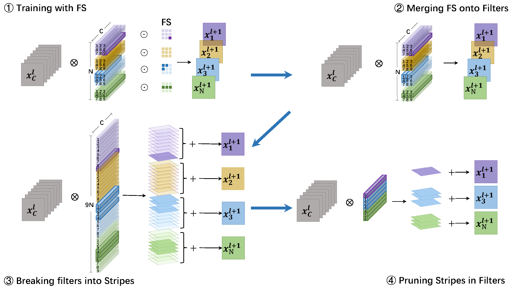

# Pruning Filter in Filter

## Introduction

This is the PyTorch implementation of our NeurIPS 2020 paper "[Pruning Filter in Filter](https://arxiv.org/abs/2009.14410)". In this paper:
1) We propose a new pruning paradigm called Stripe-wise-Pruning(SP), which can be seen as a general case of the Filter-Pruning (FP). SP treats a filter $F \in \mathbb{R}^{C\times K\times K}$as $K\times K$ stripes (i.e., $1\times 1$ filters $\in \mathbb{R}^c $ ), and perform pruning at the unit of stripe instead of the whole filter. Compared to the existing methods, SP achieves finer granularity than traditional FP while being hardware friendly than Weight-Pruning and keeping independence between filters than Group-wise-Pruning, leading to state-of-the-art pruning ratio on CIFAR-10 and ImageNet. 

2) More arousingly, by applying SP, we find another important property of filters alongside their weight: shape. Start with a random initialized ResNet56, we train and trim the shape of filters and boost the test accuracy to 80.58% on CIFAR-10 without updating the filter weights. The optimal shape of filters are learned by the proposed Filter-Skeleton (FS) in the paper and we believe FS could inspire further research towards the essence of network pruning.



## requirements

python3.7

pytorch1.4.0

torchvision0.5.0

!!!!!!!!!!!!!!!!!!!!!!!!!!!!!!!!!!!!!!!!!!!!!!!!!!!!!!!!!!!!!!!!!!!!!!!!!!!!!!!!!!!!!!!!!!!!!!!!!!!!!!!!!!!!!!!!!!!!!!!!!!!!!!!!!!!!!!!!!!!!!!!!!!!!!!!!!!!!!!!!!!!!!

Please read models/readme.md for more informations about accelerated deployment.

The subscript of I in Formula 6 in camera-ready paper should be changed from n,h,w to n,i,j.(We have fixed this problem in arxiv version)

!!!!!!!!!!!!!!!!!!!!!!!!!!!!!!!!!!!!!!!!!!!!!!!!!!!!!!!!!!!!!!!!!!!!!!!!!!!!!!!!!!!!!!!!!!!!!!!!!!!!!!!!!!!!!!!!!!!!!!!!!!!!!!!!!!!!!!!!!!!!!!!!!!!!!!!!!!!!!!!!!!!!!

## Baseline

```shell
mkdir -p checkpoint/VGG/baseline
python main.py --arch VGG --data_path ../data --save checkpoint/VGG/baseline
mkdir -p checkpoint/ResNet56/baseline
python main.py --arch ResNet56 --data_path ../data --save checkpoint/ResNet56/baseline
```

## Training with Filter Skeleton & pruning Filter in Filter

```shell
mkdir -p checkpoint/VGG/sr0.00001_threshold_0.01
python main.py --arch VGG --data_path ../data --sr 0.00001 --threshold 0.01 --save checkpoint/VGG/sr0.00001_threshold_0.01
mkdir -p checkpoint/ResNet56/sr0.00001_threshold_0.01
python main.py --arch ResNet56 --data_path ../data --sr 0.00001 --threshold 0.01 --save checkpoint/ResNet56/sr0.00001_threshold_0.01
```

## Results

> | Backbone | Metrics                  | Params(%) $\downarrow$ | FLOPS(%) $\downarrow$ | Accuracy(%)$\downarrow$ |
> | -------- | ------------------------ | ---------------------- | --------------------- | ----------------------- |
> | VGG16    | L1                       | 64                     | 34.3                  | -0.15                   |
> |          | ThiNet                   | 63.95                  | 64.02                 | 2.49                    |
> |          | SSS                      | 73.8                   | 41.6                  | 0.23                    |
> |          | SFP                      | 63.95                  | 63.91                 | 1.17                    |
> |          | GAL                      | 77.6                   | 39.6                  | 1.22                    |
> |          | Hinge                    | 80.05                  | 39.07                 | -0.34                   |
> |          | HRank                    | 82.9                   | 53.5                  | -0.18                   |
> |          | Ours                     | **92.66**              | **71.16**             | **-0.4**                |
> | ResNet56 | L1                       | 13.7                   | 27.6                  | -0.02                   |
> |          | CP                       | ---                    | 50                    | 1.00                    |
> |          | NISP                     | 42.6                   | 43.6                  | 0.03                    |
> |          | DCP                      | 70.3                   | 47.1                  | -0.01                   |
> |          | IR                       | ---                    | 67.7                  | 0.4                     |
> |          | C-SGD                    | ---                    | 60.8                  | -0.23                   |
> |          | GBN                      | 66.7                   | 70.3                  | 0.03                    |
> |          | HRank                    | 68.1                   | 74.1                  | 2.38                    |
> |          | **Ours**                 | **77.7**               | **75.6**              | **0.12**                |
> | Backbone | Metrics                  | FLOPS(%) $\downarrow$  | Top-1(%) $\downarrow$ | Top-5(%)$\downarrow$    |
> | ResNet18 | LCCL                     | 35.57                  | 3.43                  | 2.14                    |
> |          | SFP                      | 42.72                  | 2.66                  | 1.3                     |
> |          | FPGM                     | 42.72                  | 1.35                  | 0.6                     |
> |          | TAS                      | 43.47                  | 0.61                  | -0.11                   |
> |          | DMCP                     | 42.81                  | 0.56                  | ---                     |
> |          | **Ours($\alpha =5e-6$)** | **50.48**              | **-0.23**             | **-0.22**               |
> |          | **Ours($\alpha =2e-5$)** | **54.58**              | **0.17**              | **0.04**                |

## Citation

If you find this code useful, please cite the following paper:

```
@article{Meng2020PruningFI,
  title={Pruning Filter in Filter},
  author={Fan-Xu Meng and Hao Cheng and Ke Li and Huixiang Luo and Xiao-wei Guo and G. Lu and Xing Sun},
  journal={ArXiv},
  year={2020},
  volume={abs/2009.14410}
}
```

## References

For CIFAR, our code is based on https://github.com/Eric-mingjie/rethinking-network-pruning

For ImageNet, our code is based on https://github.com/pytorch/examples/tree/master/imagenet
