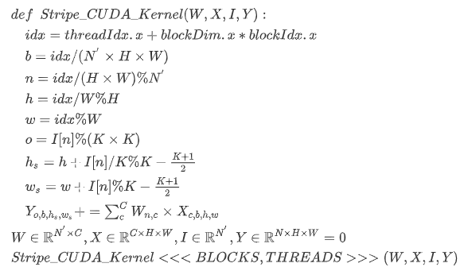
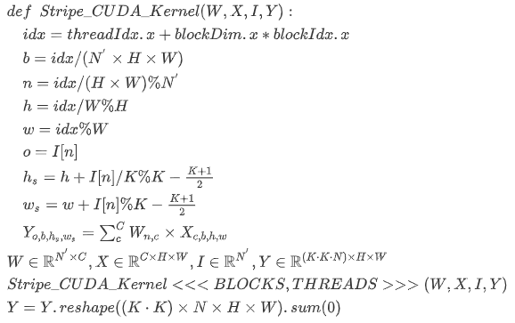

#CUDA version stripe.py

We perform stripe-wise convolution operation by python and PyTorch. Thus it can't reflect the actual inference time.

We are working on realizing a CUDA version. And you are welcome to implement this function by yourself.

We provide two ways to simply implement the function here：

or

